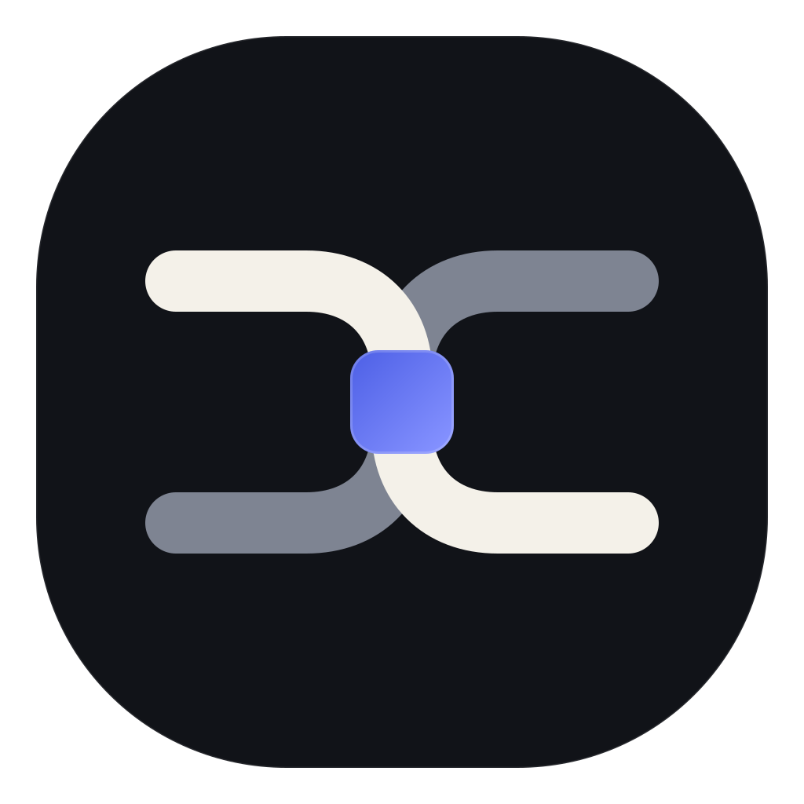

<p align="center">
  
</p>

<h1 align="center">AccordLock</h1>

<p align="center"><strong>Execution control for autonomous agents.</strong></p>

<p align="center">
  An open desktop agent and runtime that checks protected actions before they reach code, systems, or infrastructure.
</p>

<p align="center">
  <a href="https://github.com/billmedj/accordlock/actions/workflows/ci.yml"></a>
  <a href="LICENSE"></a>
  <a href="docs/PRODUCT_STATUS.md"></a>
</p>

> [!IMPORTANT]
> AccordLock is an engineering alpha for local evaluation. It is not a
> production security boundary. Signed installers, retained live cloud tests,
> and an independent security review are not complete.

## What AccordLock does

An authenticated agent can still propose the wrong action. The cause can be a
misunderstood request, untrusted repository content, prompt injection, stale
state, or an unsafe retry.

AccordLock adds a transaction boundary before a protected effect. The model
proposes an action. The runtime evaluates the approved task, policy, evidence,
state, authority, limits, and expiry. A dedicated broker performs an allowed
action and records the observed result.

```text
approved task
     |
agent proposal
     |
policy + evidence + relevant state commitments
     |
ALLOW | APPROVAL REQUIRED | DENY
     |
single-use execution grant
     |
brokered action
     |
SUCCEEDED | FAILED | UNKNOWN
```

IAM, policy engines, sandboxes, and supply-chain attestations remain in place.
AccordLock controls whether one protected action may execute now under the
approved task and current conditions.

## Security behavior

| Failure mode | Runtime behavior |
| --- | --- |
| Prompt injection changes a proposal | Untrusted content cannot grant new authority on a fully mediated path. The runtime checks the resulting action. |
| The model invents a fact | Model output is not trusted evidence. Missing or inconclusive evidence cannot enable automatic execution. |
| A target or argument changes | The action no longer matches its decision and is rejected. |
| Policy, authority, or target state changes | The stale grant is invalid. |
| A consumed grant is replayed | Atomic consumption and replay records block reuse. |
| A result cannot be confirmed | The result is `UNKNOWN`. Blind retry is blocked until reconciliation. |

This boundary applies only to supported actions routed through an AccordLock
broker. AccordLock does not claim to detect every injected instruction, prove
that an allowed action is correct, or protect an effect that bypasses the
runtime.

## Product surface

| Surface | Current scope |
| --- | --- |
| Desktop agent | Projects, protected tasks, model providers, approvals, activity, audit, and settings |
| Files and programs | Bounded file access, exact change previews, recoverable deletion, and explicit executable access |
| Network | HTTPS `GET` and `HEAD` to exact configured public domains |
| Audit | Durable action records, integrity checks, search, JSON and Markdown export, revocation, and supported file recovery |
| Cloud preflight | Read-only GitHub, ECR, EKS, and Kubernetes observations with signed receipts |
| Remote decisions | Signed Slack, Teams, Telegram, and WhatsApp protocol foundations; live gateways remain release work |

The desktop derives from
[Goose v1.47.0](desktop/UPSTREAM.md). Provider and model compatibility varies.
Model output remains untrusted regardless of provider.

## Run the provider-free demo

The fastest evaluation path needs no model account, cloud account, Docker,
Kubernetes, production credential, or external request:

```powershell
python scripts/run_demo.py --display markdown
```

The demo builds the locked native entry points and runs five enforcement cases:
protected-path denial, exact-domain denial before transport, bound approval,
single-use authorization, and stale-authority refusal.

```text
PASS provider_free_demo cases=5 provider=NONE network=NOT_ATTEMPTED
```

Requirements: Python 3.11+, the pinned Rust toolchain, and the Windows C++ build
tools on Windows. See [the demo guide](demos/README.md) for offline mode and the
adversarial walkthrough.

## Evidence and limits

The current source includes:

- **81 Lean theorems** over selected abstract authorization properties;
- **8 TLA+ models** for bounded lifecycle and concurrency exploration;
- **73 AccordBench cases** across intent conformance, transaction lifecycle,
  shared resources, and safe autonomy; and
- **10 public assurance claims** linked to models, source, and tests.

These artifacts do not prove that the Rust implementation refines every model.
They do not establish production behavior or external interoperability. Run the
claim-to-evidence checks with:

```powershell
python assurance/verify.py --root runtime --json
python -m unittest discover -s assurance/tests -t assurance -v
```

Read [the assurance contract](assurance/README.md) before citing a result.

## Research basis

[Whence](https://doi.org/10.5281/zenodo.20905713) motivates treating the
provenance of active configuration as part of authorization state. AccordLock
applies that idea through policy epochs, rooted registries, state commitments,
and stale-authority refusal. The paper informs the design; it does not prove the
implementation. See [Research provenance](docs/RESEARCH_PROVENANCE.md).

The public
[Effect Transaction Protocol (ETP)](https://github.com/billmedj/etp) defines
product-neutral transaction records and executor rules. Native ETP mediation is
an ordered roadmap item, not a current product claim.

## Current status

| Area | Status |
| --- | --- |
| Public Apache-2.0 source | The distributable source for this snapshot is present in the monorepo; see [`SOURCE_PROVENANCE.json`](SOURCE_PROVENANCE.json) |
| Runtime | Post-assembly source and tests reproduced locally |
| Desktop | Source and tests present; clean-checkout release validation remains |
| File, program, network, audit, and recovery paths | Implemented within the documented boundary |
| GitHub, ECR, EKS, and Kubernetes path | Read-only implementation; retained real-account validation remains |
| Messaging channels | Protocol and local foundations implemented; live gateway validation remains |
| Signed installers and updates | Not available |
| Production approval | No |

See [Product status](docs/PRODUCT_STATUS.md) and
[Local validation](docs/LOCAL_VALIDATION.md) for the exact evidence boundary.

## Repository map

| Path | Contents |
| --- | --- |
| [`desktop/`](desktop/) | AccordLock desktop distribution and Goose provenance |
| [`runtime/`](runtime/) | Rust policy, authorization, brokers, connectors, audit, formal models, and evaluation corpus |
| [`assurance/`](assurance/) | Claim-to-evidence manifest and verification tools |
| [`demos/`](demos/) | Provider-free demonstration and benchmark adapter |
| [`docs/`](docs/) | Architecture, threat model, limitations, status, and research provenance |

Start with the [Architecture](docs/ARCHITECTURE.md),
[Threat model](docs/THREAT_MODEL.md), [Known limitations](docs/LIMITATIONS.md),
and [Roadmap](ROADMAP.md).

## Project policy

AccordLock is available under the [Apache License 2.0](LICENSE). It preserves
the required Goose and third-party attribution in [NOTICE](NOTICE) and
[THIRD_PARTY_NOTICES.md](THIRD_PARTY_NOTICES.md).

Read [CONTRIBUTING.md](CONTRIBUTING.md) before changing a security boundary.
Report vulnerabilities through [SECURITY.md](SECURITY.md), not a public issue.

Public copy and visual rules are in [LANGUAGE.md](LANGUAGE.md) and
[BRAND.md](BRAND.md).
