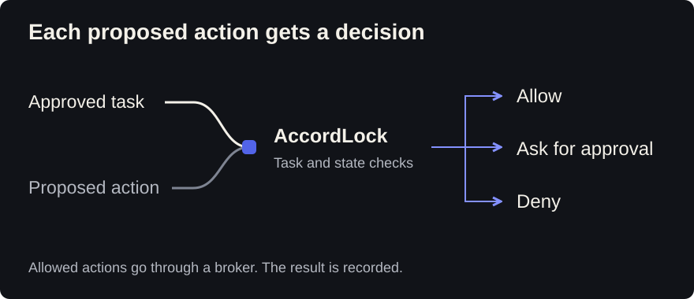

#  AccordLock

A desktop AI agent that checks actions against an approved task.

Based on [Goose](desktop/UPSTREAM.md), with a Rust runtime for protected file,
command and network operations.

[](https://github.com/billmedj/accordlock/actions/workflows/ci.yml)

**Engineering alpha.** For local evaluation. Production deployment has not been
validated, and signed installers are not available.

[Run the demo](demos/README.md) | [Desktop source](desktop/) |
[Current status](docs/PRODUCT_STATUS.md) | [Roadmap](ROADMAP.md)

## Try it without a model

From the repository root:

```powershell
python scripts/run_demo.py --display markdown
```

Requires Python 3.11+, the pinned Rust toolchain, and C++ build tools on Windows.
The demo builds native programs and tests five cases: protected files,
blocked domains, action-bound approval, single-use grants and stale authority.

```text
PASS provider_free_demo cases=5 provider=NONE network=NOT_ATTEMPTED
```

No model or cloud account is needed. The cases make no external requests.
See the [demo guide](demos/README.md) for offline mode and expected results.

## What you can use

| Area | Available in this source |
| --- | --- |
| Desktop | Projects, tasks, model connections, approvals and settings |
| Files and commands | Scoped access, change previews, recoverable file deletion and configured executable access |
| Network | HTTPS `GET` and `HEAD` on exact configured public domains |
| Audit | Action history, integrity checks, search, JSON/Markdown export, revocation and supported file recovery |
| Cloud preflight | Read-only GitHub, ECR, EKS and Kubernetes observations with signed receipts; real-account validation remains |
| Remote approvals | Local protocol foundations for Slack, Teams, Telegram and WhatsApp; live gateways still need validation |

Provider and model compatibility varies. File recovery covers supported
operations; it cannot undo every external action.

## How actions are checked

The agent proposes an action. The runtime checks its task permissions, relevant
state and expiry. An allowed action receives a single-use grant. A broker
consumes that grant before attempting the action and records the result.



Changing a bound target or argument invalidates the authorization. Consumed
grants cannot be reused. When a broker cannot confirm the result, it records
`UNKNOWN`; that outcome requires reconciliation before another attempt.

These controls apply to supported actions routed through the brokers. Untrusted
content cannot grant extra permissions on those paths. Actions that bypass the
runtime are outside its protection.

The desktop's free-text intent check currently shows **Not verified**: it has no
qualified production evidence provider. Structural task permissions still apply.
An allowed action is not proof that the model understood the request.

See the [architecture](docs/ARCHITECTURE.md) and [threat model](docs/THREAT_MODEL.md).

## Tests and formal models

This snapshot includes 81 Lean theorems over selected abstract authorization
properties, eight bounded TLA+ models and 73 AccordBench cases. Ten assurance
claims link models to source and tests.

```powershell
python assurance/verify.py --root runtime --json
python -m unittest discover -s assurance/tests -t assurance -v
```

The models do not prove the complete Rust implementation or a production
deployment. Read the [assurance contract](assurance/README.md) and
[local validation record](docs/LOCAL_VALIDATION.md) for scope and results.

[Whence](https://doi.org/10.5281/zenodo.20905713) informs the treatment of
configuration provenance and stale authority.
[Research provenance](docs/RESEARCH_PROVENANCE.md) explains that connection.

[ETP](https://github.com/billmedj/etp) defines separate, product-neutral records
for action authorization and outcomes. Native ETP mediation is planned.

## Before production use

Clean-checkout desktop validation, signed installation and updates, retained
cloud and messaging tests, and an independent security review remain open.
See [known limitations](docs/LIMITATIONS.md).

## Source and license

The [desktop](desktop/), [runtime](runtime/) and [assurance tools](assurance/)
are included here. [Source provenance](SOURCE_PROVENANCE.json) records the
published snapshot.

[Apache-2.0](LICENSE), with attribution in [NOTICE](NOTICE) and
[third-party notices](THIRD_PARTY_NOTICES.md).
Read [CONTRIBUTING.md](CONTRIBUTING.md) before changing an enforcement path.
Report vulnerabilities through [SECURITY.md](SECURITY.md).

[Visual identity](BRAND.md) | [Writing rules](LANGUAGE.md)
