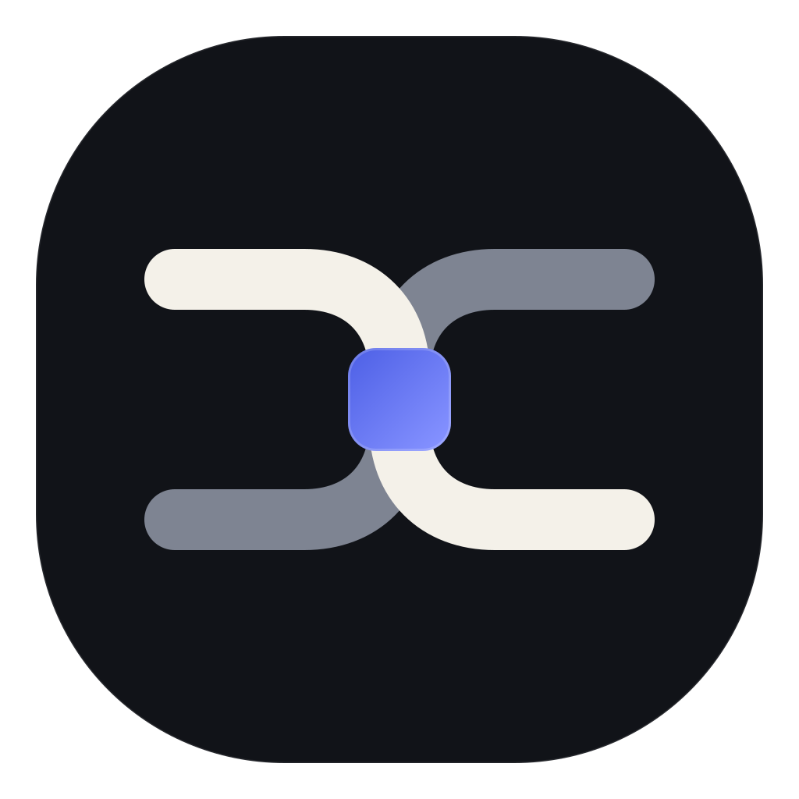

<p align="center">
  
</p>

# AccordLock

AccordLock is a security-focused desktop distribution of the Goose agent harness. It adds a fail-closed policy enforcement point between model output and protected tool execution. Users keep a familiar local agent experience while administrators define what may run, what needs approval, and what must be denied.

> **Source alpha:** AccordLock is available for review and local engineering. There is no public signed installer and no supported production release yet.

## What it adds

- A native Task flow that binds objective, workspace, capabilities, and expiry to one session.
- Exact-request authorization immediately before protected file, terminal, or network execution.
- Clear Approval requests for actions outside the approved Task scope.
- Single-use execution authorization and durable execution records.
- Fail-closed behavior when the local AccordLock runtime is unavailable or returns an invalid response.
- English-only `en-US` desktop behavior with local credential storage.

The execution lifecycle is:

`TaskRequest -> TaskAuthorization -> ToolExecutionRequest -> PolicyDecision -> ApprovalDecision -> ExecutionAuthorization -> ExecutionRecord -> TaskReport`

## Build from source

The protected Goose backend is built with an explicit feature set:

```powershell
cargo build --locked --no-default-features --features accordlock-distribution,rustls-tls,system-keyring -p goose-cli --bin goose
```

For the Windows desktop and its local runtime, use `scripts/build-windows.ps1`. Local engineering may use its `-Development` switch. Release packaging requires clean source trees and verified v2 build markers. See `ui/desktop/ACCORDLOCK_DISTRIBUTION.md` for the integration contract.

## Publication status

The repository disables inherited release, deployment, commenting, upload, and maintenance workflows by default. `scripts/check_accordlock_publication.py` verifies the public-source boundary, workflow classification, English-only catalogs, local artifact exclusions, and common secret or personal-path leaks.

## Origin and license

AccordLock is derived from [Goose](https://github.com/aaif-goose/goose) and preserves its Apache-2.0 license and attribution. See `NOTICE` and `THIRD_PARTY_NOTICES.md`. AccordLock-specific changes are also distributed under Apache-2.0 unless a file states otherwise.
